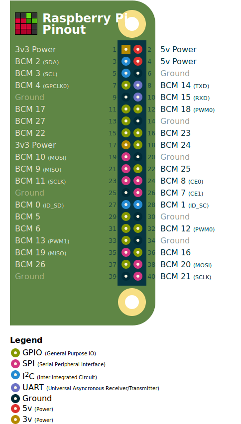

# PayGo Stockholm Edition

This is a repository for the Python code associated with the PayGo Water Filtration system built upon the Raspberry Pi 3.

Developer Notes: This project was originally developed with PyCharm IDE for the Raspberry Pi 3 B+ running Raspbian OS with a 3.5" Waveshare Model B TFT Touchscreen Rev2. 

## Hardware BOM:
    * Raspberry Pi: https://www.amazon.com/ELEMENT-Element14-Raspberry-Pi-Motherboard/dp/B07BDR5PDW/ref=sr_1_3?crid=2GC5PBOJYPTJP&keywords=raspberry+pi+3+b%2B&qid=1561411340&s=gateway&sprefix=raspberry%2Caps%2C215&sr=8-3
    * TouchScreen: https://myshopify.pcpartsource.com/products/waveshare-3-5-inch-xpt2046-raspberry-pi-resistive-lcd-320-480-tft-touch-screen?variant=9494918692911&currency=USD&utm_campaign=gs-2018-10-02&utm_source=google&utm_medium=smart_campaign&gclid=EAIaIQobChMI_62uhOeC4wIVCiSGCh35FgVLEAkYAiABEgKkCfD_BwE
    * Analog-To-Digital Converter (Adafruit's ADS1115): https://learn.adafruit.com/raspberry-pi-analog-to-digital-converters/ads1015-slash-ads1115
    * ORP Sensor (DF Robot's SEN0165): https://wiki.dfrobot.com/Analog_ORP_Meter_SKU_SEN0165_
    * 2 Channel Relay Module: https://www.amazon.com/SMAKN%C2%AE-Active-Channel-Arduino-Raspberry/dp/B00VH8926C/ref=asc_df_B00VH8926C/?tag=hyprod-20&linkCode=df0&hvadid=196274408286&hvpos=1o4&hvnetw=g&hvrand=1559779387324966882&hvpone=&hvptwo=&hvqmt=&hvdev=c&hvdvcmdl=&hvlocint=&hvlocphy=9011447&hvtargid=pla-315539484865&psc=1
    * Assorted wires, barrel jacks, connectors, etc.
    
Image from https://pinout.xyz/#

## Hardware Setup:
    * The Raspberry Pi is powered by a Micro-USB cable. The USB should be connected to a 3 amp adapter (i.e. a "fast-charger"). 
    * The Touchscreen attaches to the GPIO headers on the Raspberry Pi, so that the screen covers the entirety of the Raspberry Pi (Pins 1-26)
    * The Flowmeter, Relay, ORP, ADC, and other 5V components should be powered from a 5V USB separate from the Raspberry Pi. However, this USB's ground wire should also be connected to one of the GND pins on the Raspberry Pi to ensure everything has a common ground.
    * The signal pin on the Flowmeter should go to GPIO 16 (Pin 36).
    * The signal pin on the Relay should go to GPIO 20 (Pin 38)
    * The ORP signal must be converted from an an analog signal to a digital signal. The signal pin on the ORP should run to the A0 pin on the ADS1115.
    * The SDA pin on the ADS1115 should go to the SDA/Data pin on the Raspberry Pi's I2C. This is GPIO2/Pin 3. The SCL pin should go to the SCL/Clock pin on the Raspberry Pi, GPIO3/ Pin 5.

## Software Setup:
    The Raspberry Pi should be connected to the VNC server to allow for remote updates and debugging. Allow VNC Access in the Raspberry Pi's Configuration Settings, connect your Pi to the internet, and setup VNC Viewer (https://www.raspberrypi.org/documentation/remote-access/vnc/).
    
    Move the PayGo code to the Raspberry Pi. Transfer StartSystem.sh, main.py, BuildDB.sql, and the directory ./paygo/ to the desktop of the Raspberry Pi.
    
    The PayGo system relies on Kivy for the UI framework and SQLite for the database. The following instructions are meant to be followed from the Desktop of the Raspberry Pi.
    
    # Install Kivy:
        1. Open a terminal
        2. sudo apt update
        3. Install setuptools: python3 -m pip install --upgrade --user pip setuptools
        4. python3 -m pip install --user kivy
        5. These dependencies need installation, too: sudo apt install libsdl2-dev libsdl2-image-dev libsdl2-mixer-dev libsdl2-ttf-dev \
        pkg-config libgl1-mesa-dev libgles2-mesa-dev \
        python-setuptools libgstreamer1.0-dev git-core \
        gstreamer1.0-plugins-{bad,base,good,ugly} \
        gstreamer1.0-{omx,alsa} python-dev libmtdev-dev \
        xclip xsel libjpeg-dev

        Modified from https://kivy.org/doc/stable/installation/installation-rpi.html. Refer to this link if something doesn't work
    
    # Setup Database
        0. Open a terminal
        1. Install SQLite: sudo apt-get install sqlite3
        2. Install the database viewing software: sudo apt-get install sqlitebrowser
        3. Create a new database: sqlite3 ~/Desktop/PGWC/paygo.db
        4. Copy and Paste the contents of ~/Desktop/BuildDB.sql into the terminal.
        5. Exit sqlite3 by hitting Ctrl+C until sqlite3 closes
        6. Open sqlitebrowser to verify that the code executed successfully
        
    #Configure the Touch screen:
        1. The touch screen must be configured according to the Manufacturer's instructions. In this case, the drivers should be downloaded directly from WaveShare for the 3.5" TFT Screen Model B Rev 2: https://www.waveshare.com/wiki/3.5inch_RPi_LCD_%28B%29 . 

    
Start the PayGo Kiosk by double-clicking on StartSystem.sh. The kiosk will fill the screen and can be exited by hitting the ESC key or by turning the Raspberry Pi off and on again.

